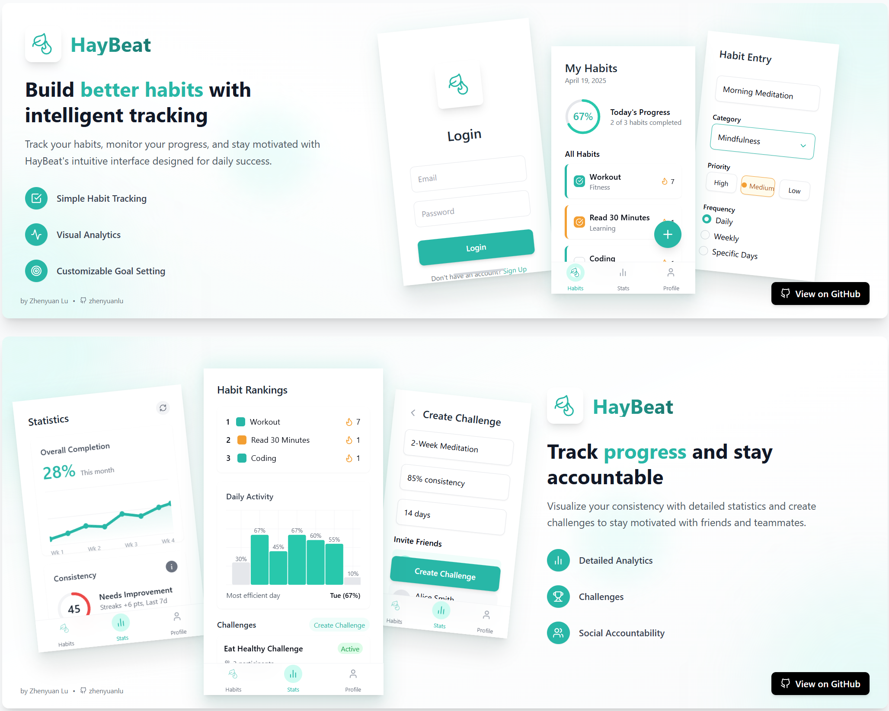
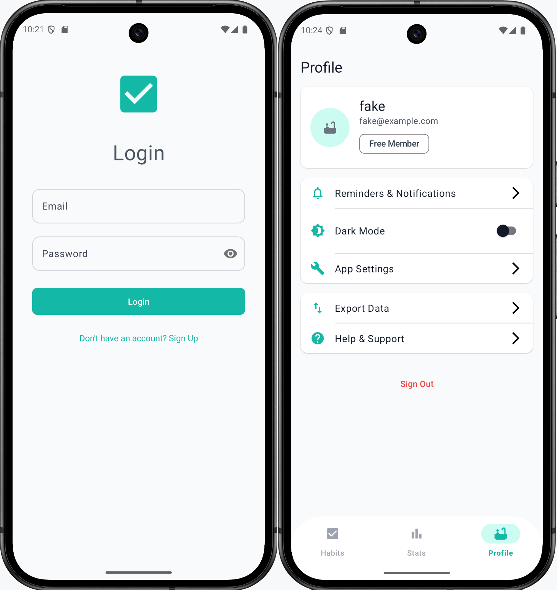
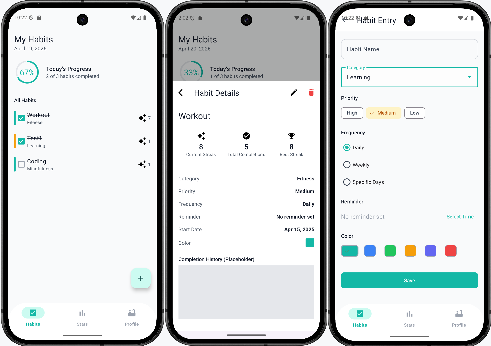
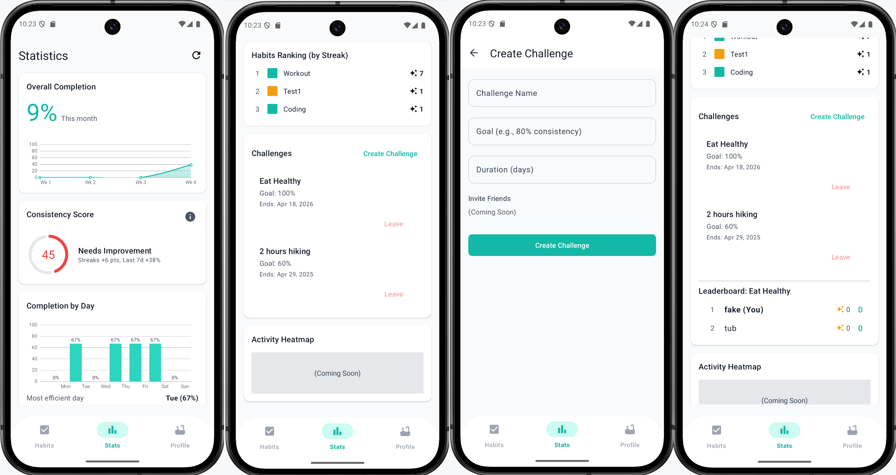

<p style="line-height:25px;margin:0px;"><br></p>

<p align="center">
  
</p>

<p style="line-height:25px;margin:0px;"><br></p>

<h1 align="center">
    <b>HayBeat (Ha-bit)</b>
</h1>

<p align="center">
<a href="https://img.shields.io/badge/License-MIT-blue.svg" target="_blank">
    
</a>
<a href="https://img.shields.io/badge/Kotlin-1.8.x%2B-blueviolet" target="_blank">
    
</a>
<a href="https://img.shields.io/badge/Firebase-Auth%20%7C%20Firestore%20%7C%20AppCheck-orange" target="_blank">
    
</a>

<a href="https://img.shields.io/badge/Hobby-For%20Fun-green" target="_blank">
    
</a>


**Haybeat** is a playful, lightweight Android habit tracker I built to escape the bloat of heavier apps and to push my own limits in a fun side project. Developed with Kotlin and Firebase, it offers gentle reminders, straightforward stats, and social challenges to spark positive habits, all made easier thanks to my debugging buddy **gemini**, who kept coding fun (and sometimes hilariously frustrating!)

## UI Screenshots


<p align="center">
  
</p>
<p align="center">
  <span>Login and profile screen</span>
</p>


<p align="center">
  
</p>
<p align="center">
  <span>Habit list and add habit screen</span>
</p>


<p align="center">
  
</p>
<p align="center">
  <span>Statistics and challenge screen</span>
</p>

## Features

*   **User Authentication:** Secure Sign Up and Login using Firebase Authentication (Email/Password).
*   **Habit Management:**
    *   Create, Edit, and Delete (Archive) habits.
    *   Customize habits with names, categories, priority levels, and colors.
    *   Flexible frequency options: Daily, Weekly (target count), Specific Days of the week.
    *   Set optional daily reminders with customizable times.
*   **Daily Tracking:** Mark habits as complete/incomplete for the current day.
*   **Streak Calculation:** Automatically tracks current and longest streaks for each habit.
*   **Statistics & Visualization:**
    *   Overall completion percentage (monthly).
    *   Consistency score calculation.
    *   Completion trend line chart (e.g., weekly).
    *   Completion by day bar chart.
    *   Habit ranking based on current streak.
*   **Challenges:**
    *   Create habit challenges with goals and optional durations.
    *   View active challenges.
    *   Display leaderboards based on participant progress (requires manual progress update in current implementation).
*   **Reminders & Notifications:**
    *   Scheduled notifications for habit reminders (uses `AlarmManager`).
    *   "Mark as Done" action directly from the notification.
    *   Permissions handling for Notifications (Android 13+) and Exact Alarms.
    *   Reschedules alarms on device boot.
*   **Profile Management:**
    *   View basic user profile information (name, email).
    *   Sign Out functionality.
    *   Dark Mode toggle with persistence (`AppCompatDelegate` & `SharedPreferences`).
*   **Modern UI:**
    *   Built with Material Components 3.
    *   Uses ViewBinding for type-safe view access.
    *   Navigation Component for fragment navigation.
    *   Clean UI for displaying lists (RecyclerView), details, and stats (MPAndroidChart).


## Tech Stack & Dependencies

*   **Language:** [Kotlin](https://kotlinlang.org/)
*   **Architecture:** MVVM (Model-View-ViewModel), Repository Pattern
*   **UI:**
    *   [Material Components for Android](https://material.io/develop/android/docs/getting-started)
    *   ViewBinding
    *   [Android Navigation Component](https://developer.android.com/guide/navigation)
    *   RecyclerView, CardView, BottomNavigationView, Fragments
*   **Asynchronous Programming:** [Kotlin Coroutines](https://kotlinlang.org/docs/coroutines-overview.html)
*   **Backend & Database:**
    *   [Firebase Authentication](https://firebase.google.com/docs/auth) (Email/Password)
    *   [Firebase Firestore](https://firebase.google.com/docs/firestore) (NoSQL Database)
    *   [Firebase App Check](https://firebase.google.com/docs/app-check) (Play Integrity)
*   **Charting:** [MPAndroidChart](https://github.com/PhilJay/MPAndroidChart)
*   **Dependency Injection:** (Implicitly via ViewModels factory, could be expanded with Hilt/Dagger)
*   **Reminders:** Android `AlarmManager`, `BroadcastReceiver`
*   **Other:** AndroidX Libraries (AppCompat, Core KTX, Lifecycle, etc.)

## Architecture

The application follows the MVVM (Model-View-ViewModel) architectural pattern utilizing Android Architecture Components:

*   **View:** Activities and Fragments (e.g., `HabitsFragment`, `LoginActivity`). Responsible for observing ViewModel updates and displaying the UI. Uses ViewBinding.
*   **ViewModel:** (e.g., `HabitsViewModel`, `AddHabitViewModel`). Holds UI-related data, exposes state via `LiveData`, and handles user interactions by communicating with the Repository. Survives configuration changes.
*   **Repository:** (e.g., `HabitRepository`, `ChallengeRepository`). Single source of truth for data. Abstracts data sources (Firestore) from the ViewModels. Handles data fetching and manipulation logic.
*   **Model:** Data classes (e.g., `Habit`, `Challenge`, `User`). Represent the data structure.
*   **Service:** Contains components like `AlarmManager` wrappers (`AlarmScheduler`) and `BroadcastReceivers` (`HabitReminderReceiver`, `BootReceiver`) for background tasks like notifications.
*   **Navigation:** Managed by the Android Navigation Component (`nav_graph.xml`).

## Getting Started

### Prerequisites

*   [Android Studio](https://developer.android.com/studio) (Latest stable version recommended)
*   JDK 11 or higher
*   A Firebase account

### Installation & Setup

1.  **Clone the repository:**
    ```bash
    git clone https://github.com/zhenyuanlu/haybeat.git 
    cd haybeat
    ```
2.  **Open in Android Studio:** Open the cloned project directory in Android Studio.
3.  **Firebase Setup:**
    *   Go to the [Firebase Console](https://console.firebase.google.com/).
    *   Create a new Firebase project (or use an existing one).
    *   **Register your Android app:**
        *   Add an Android app to your Firebase project.
        *   Use the package name: `com.example.haybeat` (or update it in `build.gradle(:app)` and the manifest if you change it).
        *   Download the `google-services.json` configuration file.
    *   **Place `google-services.json`:** Copy the downloaded `google-services.json` file into the `app/` directory of your project in Android Studio.
    *   **Enable Firebase Services:**
        *   In the Firebase Console, enable **Authentication** and select the **Email/Password** sign-in method.
        *   Enable **Firestore Database**. Create it in **Native Mode** (choose a region). *Note: Default security rules are restrictive; you might need to adjust them for development/production.*
        *   (Recommended) Enable **App Check** and register the **Play Integrity** provider for your Android app.
    *   **Firestore Indexes:** As the application uses queries (e.g., filtering challenges by `active`, ordering habits), Firestore might require specific composite indexes. If you encounter errors related to missing indexes during runtime, follow the link provided in the Android Studio Logcat error message to create them directly in the Firebase Console.
4.  **Build the project:** Let Android Studio sync Gradle files. Click `Build > Make Project` or run the app.
5.  **Run the app:** Select a target device (emulator or physical device) and click the Run button in Android Studio.

## Configuration

*   The primary configuration needed is the `google-services.json` file obtained from Firebase.
*   Default Firestore security rules might need adjustment based on your requirements.


## License

This project is licensed under the **MIT License**. See the [LICENSE](LICENSE) file for details.

## Contact
Zhenyuan Lu
